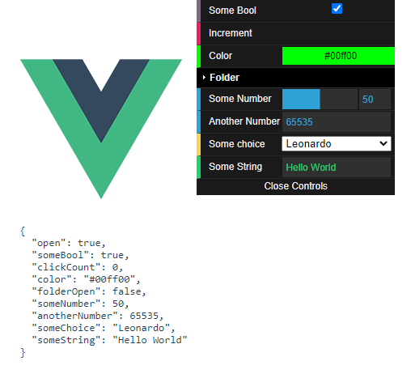

# dat-gui-vue



> A Vue 3 port of [@cyrilf/vue-dat-gui](https://github.com/cyrilf/vue-dat-gui), which is a Vue.js port of the popular [dat.GUI](https://github.com/dataarts/dat.gui) library.

## Install

```
npm install --save dat-gui-vue
```

## Usage

```js
import { DatGui, DatString } from "dat-gui-vue";

export default {
  components: { DatGui, DatString },
};
```

```html
<DatGui>
  <DatString v-model="someString" />
</DatGui>
```

## Components

### DatGui

The main UI.

```html
<DatGui
  v-model:open="isOpen"
  open-text="Open Controls"
  close-text="Close Controls"
  close-position="bottom"
>
  ... other components ...
</DatGui>
```

- `v-model:open` (Optional) Bind to the open state of the GUI.
- `open-text` (Optional) Text to display when GUI is closed.
- `close-text` (Optional) Text to display when GUI is open.
- `close-position` (Optional) Snap to top or bottom of screen.

### DatBoolean

A checkbox to indicate true or false

```html
<DatBoolean v-model="someBoolean" label="My Boolean" />
```

- `v-model` (Required) Bind to a boolean value in your model.
- `label` (Optional) Text to display as the label.

### DatButton

A button

```html
<DatButton @click="onClick" label="Click me" />
```

- `@click` (Optional) Click handler
- `label` (Optional) Button text

### DatColor

A color selector

```html
<DatColor v-model="someColor" label="My Color" />
```

- `v-model` (Required) Bind to a color string
- `label` (Optional) Text to display as the label.

### DatFolder

A collapsible folder containing other controls

```html
<DatFolder v-model:open label="My Folder"> ... other components ... </DatFolder>
```

- `v-model:open` (Optional) Bind to the open state of the folder.
- `label` (Optional) Folder label

### DatNumber

A number slider / input. If `min` and `max` are specified, then
a slider will be visible.

```html
<DatNumber
  v-model="someNumber"
  :min="0"
  :max="100"
  :step="5"
  label="My Number"
  :show-slider="false"
/>
```

- `v-model` (Required) Bind to a number
- `min` (Optional) Minimum value
- `max` (Optional) Maximum value
- `step` (Optional) Incremental value
- `label` (Optional) Text to display as the label
- `show-slider` (optional) Option to hide the slider

### DatSelect

A dropdown list. Options can be `[{name, value}, ...]` or `[value, ...]`.

```html
<DatSelect v-model="someValue" :items="someArray" label="My Dropdown" />
```

- `v-model` (Required) Bind to a value
- `items` (Required) Array of `{name, value}` or array of values.
- `label` (Optional) Text to display as the label

### DatString

A text input.

```html
<DatString v-model="someString" :label="My String" />
```

- `v-model` (Required) Bind to a string
- `label` (Optional) Text to display as the label
